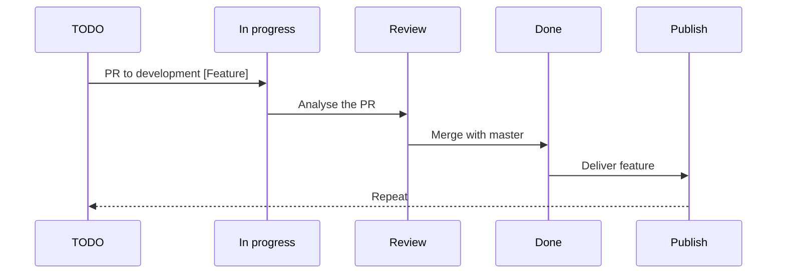

# **swagger-validation-express**

a validation middleware for express applications based on swagger file

# Note

the npm package is still not ready , you can contibute to the development phase and since we are at the beggining it can be a perfect oppurtunity

## Hummm more info?

we are building this npm package using typescript and best practices to deliver optimal code that can be used any time and at any level of abstraction, so if you have better idea feel welcome

## how to start

1.  well all you need is to clone our repo
2.  `npm install` (note we are using npm but switching to yarn is not a big deal)
3.  `npm dev` reall time development
4.  and taraa.... walk throught the code, chack our project and try to pick a task from issues, or if you have something in mind to do just add it



```

```
